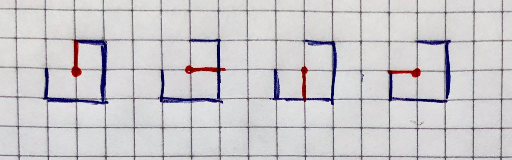
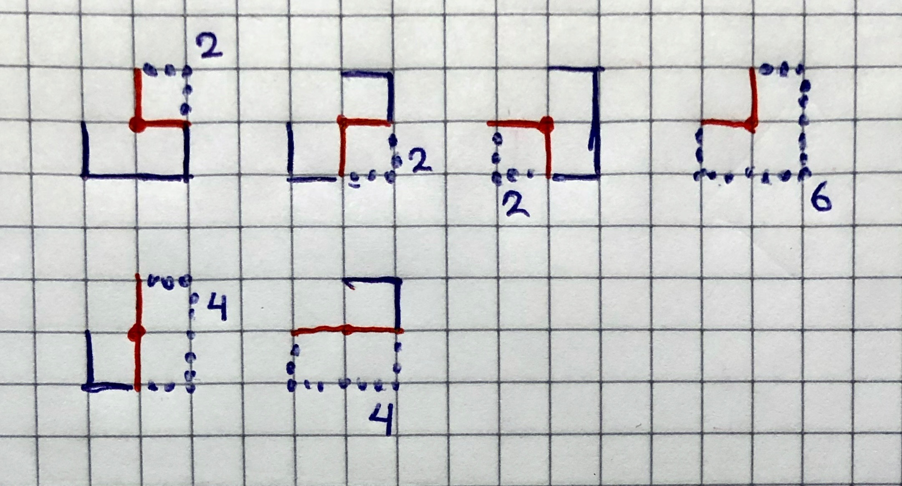
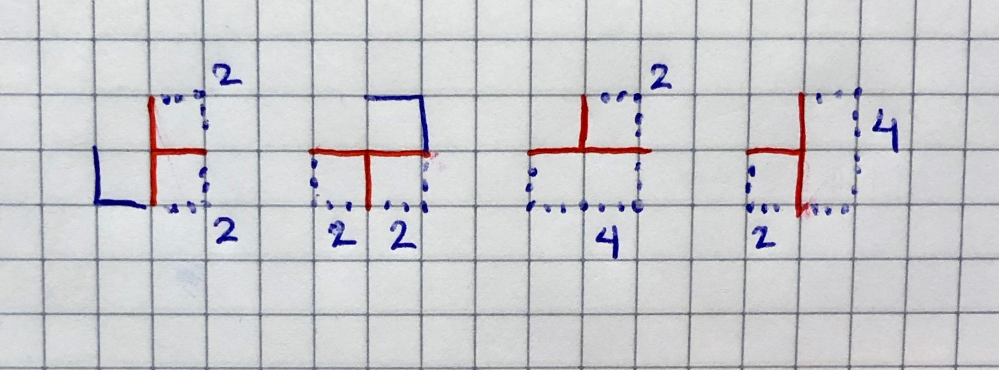
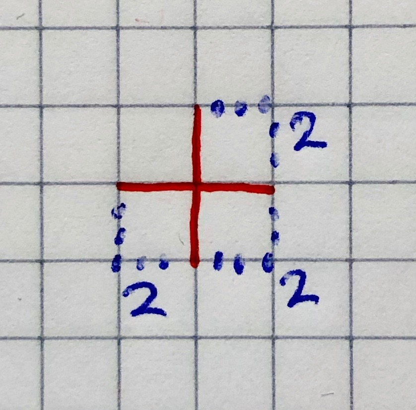

# Exercise solutions: Graphs

Here are suggested solutions to the exercises about graphs.

## Core exercises

## Undirected graphs (A)

### A1. Depth-first search

- [a]  A B C E D F G H
- [b]  H E B A D F G C
- [c]  A C B H G F D E
- [d]  A B D C E F H G

### A2. Adjacency lists

The last edge added (say x–y) will be first in two adjacency lists (x–y in adj(x) and y–x in adj(y)). So, any adjacency list where there is no edge occurring first twice is impossible, such as this one:

- A ⟼ [A–B, A–D]
- B ⟼ [B–C, B–A]
- C ⟼ [C–D, C–B]
- D ⟼ [D–A, D–C]

### A3. BFS tree

Not much. Only that dist(*v,w*) ≤ dist(*s,v*) + dist(*s,w*).

### A4. BFS with a stack

No.

### A5. Nonisomprphic graphs

See here: <http://www.graphclasses.org/smallgraphs.html#nodes2>

## Directed graphs (B)

### B1. Draw adjacency lists

Any variant of this, where the lists of outgoing edges from a node can be in any order:

* 0 ⟼ [0→2, 0→4]
* 1 ⟼ [1→3]
* 2 ⟼ [2→7]
* 3 ⟼ [3→6]
* 4 ⟼ [4→5, 4→7]
* 5 ⟼ [5→1, 5→4, 5→7]
* 6 ⟼ [6→0, 6→2, 6→4]
* 7 ⟼ [7→3, 7→5]

For example, 5 can map to the list [5→1, 5→4, 5→7], or [5→4, 5→1, 5→7], or [5→7, 5→4, 5→1], or ... etc. etc.

### B2. Depth-first search

- [a]  9 10 12 11 4 2 0 1 5 3
- [b]  6 0 1 5 4 2 3 8 9 10 12 11
- [c]  12 10 1 5 0 3 2 4 11 9
- [d]  9 10 11 12 4 2 3 0 5 1

### B3. Topological orderings

Any two out of the four possible topological orderings of the graph:

- 10 6 9 8 7 5 4 2 1 3
- 10 6 9 8 5 7 4 2 1 3
- 6 10 9 8 7 5 4 2 1 3
- 6 10 9 8 5 7 4 2 1 3

## Minimum spanning trees (C)

### C1. Compute a MST

There is only one MST, and it's a tree with the following three branches: A–D–E–H–G,  A–B–C,  and D–F. (In other words, the following edges are not in the MST: BE, CE, FG).

- [a] Kruskal: Consider the edges in weight order – add an edge to the SPT if it doesn't create a cycle. The edges will be added in the following order: AD, DE, GH, AB, BC, DF, EH. (DE and GH can be added in any order, as can AB and BC)

- [b] Prim, starting from A: The edges will be added to the SPT in the following order: AD, DE, AB, BC, DF, EH, GH

### C2. Maximum spanning tree

Negate all weights, and then build the minimum spanning tree.

Alternatively (and equivalently): build a tree the same way you would a minimum spanning tree using a different criterion for picking edges – pick the maximum weighted edge instead of minimum.

### C3. Adding an edge to the MST

(from the [S&W website](https://algs4.cs.princeton.edu/43mst/)) "Adding the edge *e* to the MST creates a unique cycle. Delete the maximum weight edge on this cycle."

## Shortest paths (D)

### D1. Draw the shortest path tree

- [a] a tree consisting of the two branches 0→2 and 0→4→5→1→3→6
- [b] a tree consisting of the single branch 0→6→3→1→5→4  (node 2 is unreachable)

### D2. Draw another SPT

- a tree consisting of the branches 2→0→4, 2→7→3→6, and (2→)7→5→1.

## Bonus exercises

### Undirected graphs (E)

### E1. Nonisomorphic graphs

See here: <http://www.graphclasses.org/smallgraphs.html#nodes2>

### E2. Removing vertices

- [a] Proof sketch: Every connected graph has a spanning tree. If you remove a leaf of the spanning tree, the graph will not become disconnected. (A leaf is a node with degree 1)
- [b] Left as exercise.

### E3. Eccentricity

Here's a sketch:

- eccentricity(v):
   1. run ucs(v) to get the SPT
   2. return max(dist(v,w) for every w in V)
   - there is a faster version, if you modify ucs(v) to record the max length

- diameter(): max(eccentricity(v) for every v in V)

- radius(): min(eccentricity(v) for every v in V)

- center(): any v in V such that eccentricity(v) == radius()

### E4. Eulerian and Hamiltonian cycles

Left as exercise.

## Directed graphs (F)

### F1. Nonisomprphic graphs

Start from <http://www.graphclasses.org/smallgraphs.html#nodes2>, and for every graph class, count the number of possible isomorphic ways to add directions to the edges (without creating cycles):

- 2 nodes (2 different DAGs in total):
   - 2K1:  1 DAG
   - K2:  1 DAG

- 3 nodes (6 different DAGs in total):
   - 3K1 = co-K3 = co-triangle:  1 DAG
   - K3 = C3 = triangle:  1 DAG
   - co-P3:  1 DAG
   - P3:  3 DAGs (the node with two connections can be first, mid or last)

- 4 nodes (31 different DAGs in total):
   - 4K1 = co-K4:  1 DAG
   - K4 = W3:  1 DAG
   - co-diamond = 2-fan:  1 DAG
   - diamond:  6 DAGs
   - co-paw:  3 DAGs
   - paw = 3-pan:  6 DAGs
   - 2K2 = co-C4:  3 DAGs
   - C4 = K2,2:  1 DAG
   - claw = K1,3:  4 DAGs
   - co-claw:  1 DAG
   - P4: 4 DAGs

These are part of the integer sequence [A003087 "Number of acyclic digraphs with n unlabeled nodes"](https://oeis.org/A003087).

### F2. Unique topological ordering

Left as (advanced) exercise.

## Minimum spanning trees (G)

### G1. Draw all MSTs

Start from the mid node (4), and think about which connections it can have in a spanning tree. For each possible way of connecting (4), count the possible spanning trees:

- one connection (4 trees in total):
   - 
   - 41 (north): 1 tree
   - 45 (east): 1 tree
   - 47 (south): 1 tree
   - 43 (west): 1 tree

- two connections (20 trees in total):
   - 
   - 41+45 (n+e): 2 trees
   - 45+47 (e+s): 2 trees
   - 47+43 (s+w): 2 trees
   - 41+43 (n+w): 6 trees
   - 41+47 (n+s): 4 trees
   - 45+43 (e+w): 4 trees

- three connections (24 trees in total):
   - 
   - 41+45+47 (n+e+s): 2 x 2 = 4 trees
   - 45+47+45 (e+s+w): 2 x 2 = 4 trees
   - 41+45+43 (n+e+w): 2 x 4 = 8 trees
   - 41+47+43 (n+s+w): 2 x 4 = 8 trees

- four connections (8 trees in total):
   - 
   - 41+45+47+43 (n+e+s+w): 2 x 2 x 2 = 8 trees

- all in all there are 4 + 20 + 24 + 8 = 56 trees

### G2. Uniqueness of MST

Our hypothesis: that all edges in a given graph have distinct weights.

We can proceed by contradiction: suppose there are two different MSTs T1, T2. (Side note: this means particularly that they must have the same overall weight: Σe ∈ T1 ω(e) = Σe ∈ T2 ω(e) ). Since they are different, there must be at least one edge in one of the trees which is not in the other (and vice versa!). Let's say e1 is the edge with minimum possible weight which can be found in one tree but not the other. We may assume e1 ∈ T1, and so e1 ∉ T2 (the converse would not affect the following reasoning). If we add e1 to T2 (call this new graph G) we would create a cycle in it (make sure you understand why adding an edge between existing nodes in a tree creates a cycle). T1 is a tree, therefore it cannot contain the cycle we have just created. This means some edge in that cycle must not be in T1. Let's name this edge e2.

Now we can build a new spanning tree by removing e2 from G (let's call it T2\*; this graph is still a tree: removing an edge from the cycle in G breaks the cycle and still maintains the connectivity). Necessarily, ω(e2) > ω(e1) because we chose e1 to be the smallest edge only present in one of the trees. So ω( T2\* ) = ω(T2) + ω(e1) – ω(e2) < ω(T2). That is, T2\* is a spanning tree with lower weight than the initial T2. We've arrived at a contradiction! (T2 was assumed to be a minimum spanning tree.)

### Shortest paths (H)

### H1. Vertex weights

Sketch: Split every vertex into two: one with only the ingoing edges and one with only the outgoing edges. Connect the two using one new edge having the weight of the original vertex.

### H2. Number maze

General idea: create a *directed* graph where:

- nodes are positions in the grid
- edges reflect the legal moves by connecting each node (via outgoing edges) to those other positions in the maze one can jump to from it

We may then solve the shortest path problem between the node corresponding to the start cell (source of the path) and the node corresponding to the goal cell.

Note that more details should be worked out to implement this! E.g.: how to specify which edges to have in the graph.
