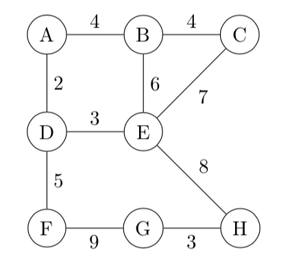
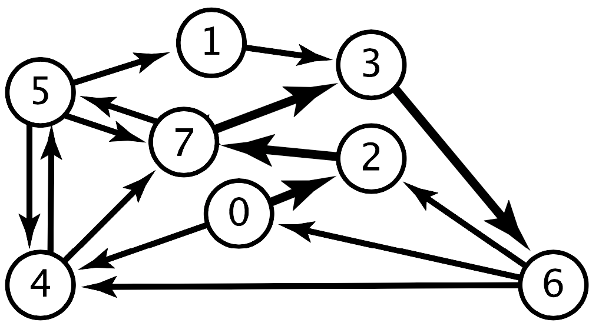
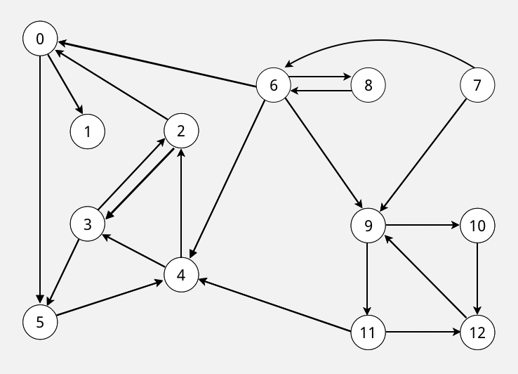
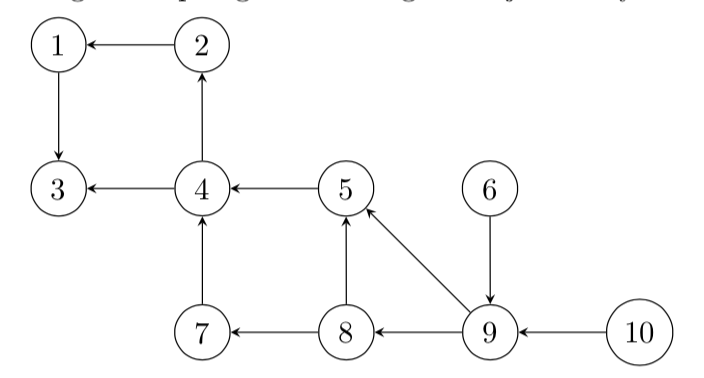
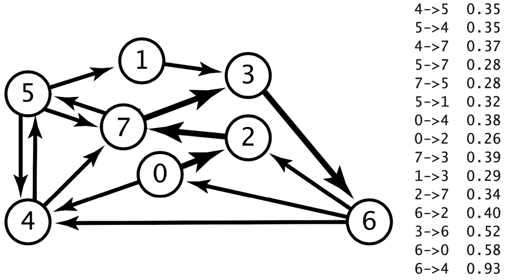
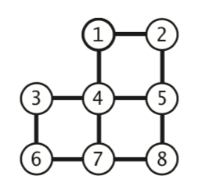
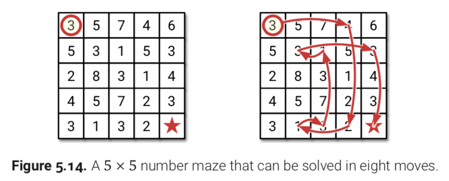

# Exercises: Graphs

**Note:**
The exercises are optional, but highly recommended.
If you are uncertain about any problem or want to discuss, write in the course discussion channel, or ask a teacher.

The exercises are divided into ***core*** and ***bonus***.
We recommend you try all the core exercises.
Try some of the bonus exercises if you want to learn more.

Most of the following exercises are from the book by Segdewick & Wayne (written S&W below).
Many of them can also be found at the book website:

- undirected graphs: <https://algs4.cs.princeton.edu/41graph/>,
- directed graphs: <https://algs4.cs.princeton.edu/42digraph/>,
- minimum spanning trees: <https://algs4.cs.princeton.edu/43mst/>,
- shortest paths: <https://algs4.cs.princeton.edu/44sp/>.


## Core exercises

First, try the graph quiz on Canvas.

### Undirected graphs (A)

**A1**.
Perform a depth-first search (DFS) over the following graph, and collect the visited vertices in a list.
Break ties alphabetically (i.e., the adjacent vertices from vertex E should be tried in the order B, C, D, H).
Disregard the weights.



- [a] Start from vertex A, collect the vertices in *preorder*.
- [b] As [a], but start from vertex H.
- [c] Remove the edge A–D, then start from vertex E, and collect the vertices in *postorder*.
- [d] As [a], but use *breadth-first* search (BFS) instead.

**A2** [S&W 4.1.6].
Consider the four-vertex graph with edges A–B, B–C, C–D, and D–A.
Draw an array of adjacency-lists that could not have been built calling `addEdge()` for these edges *no matter what order*.

**A3** [S&W 4.1.12].
What does the BFS tree tell us about the distance between vertices *v* and *w* when neither is at the root?

**A4** [S&W 4.1.14].
Suppose you use a stack instead of a queue when running breadth-first search.
Does it still compute shortest paths?

**A5** [modified from S&W 4.1.28].
Two graphs are *isomorphic* if there is a way to rename the vertices of one to make it identical to the other.

- [a] Draw all the nonisomorphic graphs with *two* vertices.
- [b] Draw all the nonisomorphic graphs with *three* vertices.

You can assume that the graphs have no self-loops and no parallel edges.


### Directed graphs (B)

**B1**.
Draw two different possible adjacency list representations for the following graph (borrowed from page 644 in S&W):



**B2** [follow-up to **A1**].
Perform a depth-first search over the following graph, and collect the visited vertices in a list.
Break ties numerically (i.e., the adjacent vertices from vertex 6 should be tried in the order 0, 4, 8, 9).



- [a] Start from vertex 9, collect the vertices in *preorder*.
- [b] As [a], but start from vertex 6.
- [c] As [a], but collect the vertices in *postorder*.
- [d] As [a], but use *breadth-first* search (BFS) instead.

**B3**. Find two different topological orderings of the following digraph:




### Minimum spanning trees (C)

**C1**.
Compute a minimum spanning tree for the following graph by manually performing

- [a] Kruskal's algorithm.
- [b] Prim’s algorithm using A as starting vertex.


**C2** [S&W 4.3.7].
How would you find a *maximum* spanning tree of a weighted graph?

**C3** [S&W 4.3.15].
Given an MST for a weighted graph *G* and a new edge *e* with weight *w*, describe how to find an MST of the new graph in time proportional to the number of vertices |*V*|.


### Shortest paths (D)

**D1** [4.4.4].
Assume the following weighted directed graph (which is the same graph as in **B1**):



- [a] Draw the unique SPT (shortest path tree) for source 0 of the weighted directed graph obtained by deleting vertex 7 from the graph above.
- [b] Answer the question for the same graph as in [a], but with all edges reversed.

**D2** [4.4.5].
Change the direction of edge 0→2 in the previous graph. Draw the SPT that is rooted at vertex 2 for this modified edge-weighted digraph.


## Bonus exercises

### Undirected graphs (E)

**E1** [follow-up to **A5**].
Draw all the nonisomorphic graphs with *four* vertices.

**E2** [S&W 4.1.10].

- [a] Prove that every connected graph has a vertex whose removal (including all adjacent edges) will not disconnect the graph.
- [b] Write a DFS method that finds such a vertex.

  <details><summary><em>Hint:</em></summary>
  Consider a vertex whose adjacent vertices are all marked.
  </details>

**E3** [S&W 4.1.16].
The *eccentricity* of a vertex *v* is the length of the shortest path from that vertex to the furthest vertex from *v*.
The *diameter* of a graph is the maximum eccentricity of any vertex.
The *radius* of a graph is the smallest eccentricity of any vertex.
A *center* is a vertex whose eccentricity is the radius.
Implement the following API:

```python
class GraphProperties:
    new GraphProperties(G)   # constructor (exception if G not connected)
    eccentricity(v) -> int   # returns the eccentricity of a vertex v
    diameter() -> int        # returns the diameter of G
    radius() -> int          # returns the radius of G
    center() -> V            # returns a center vertex of G
```

**E4** [S&W 4.1.30, *Eulerian and Hamiltonian cycles*].
Consider the graphs defined by the following four sets of edges:

1. {0-1, 0-2, 0-3, 1-3, 1-4, 2-5, 2-9, 3-6, 4-7, 4-8, 5-8, 5-9, 6-7, 6-9, 7-8}
2. {0-1, 0-2, 0-3, 1-3, 0-3, 2-5, 5-6, 3-6, 4-7, 4-8, 5-8, 5-9, 6-7, 6-9, 8-8}
3. {0-1, 1-2, 1-3, 0-3, 0-4, 2-5, 2-9, 3-6, 4-7, 4-8, 5-8, 5-9, 6-7, 6-9, 7-8}
4. {4-1, 7-9, 6-2, 7-3, 5-0, 0-2, 0-8, 1-6, 3-9, 6-3, 2-8, 1-5, 9-8, 4-5, 4-7}

- [a] Which of these graphs have Euler cycles (cycles that visit each edge exactly once)?
- [b] Which of them have Hamilton cycles (cycles that visit each vertex exactly once)?


### Directed graphs (F)

**F1** [S&W 4.2.8, follow-up to **A5** and **E1**].

- [a] Draw all the nonisomorphic DAGs with *two* vertices.
- [b] Draw all the nonisomorphic DAGs with *three* vertices.
- [c] Draw all the nonisomorphic DAGs with *four* vertices.

**F2** [S&W 4.2.33, *unique topological ordering*].
Design an algorithm to determine whether a DAG has a unique topological ordering.

<details><summary><em>Hint:</em></summary>
A DAG has a unique topological ordering if and only if there is a directed edge between each pair of consecutive vertices in the topological order (i.e., the digraph has a Hamiltonian path). If the DAG has multiple topological orderings, then a second topological order can be obtained by swapping a pair of consecutive vertices.
</details>


### Minimum spanning trees (G)

**G1** [modified from S&W 4.3.2].
Draw all spanning trees of the graph depicted below.



**G2** [S&W 4.3.3].
Show that if the edges of a graph all have distinct weights, the graph has a unique MST.


### Shortest paths (H)

**H1** [S&W 4.4.22, *vertex weights*].
Show that shortest-paths computations in weighted directed graphs with nonnegative *weights on vertices* (where the weight of a path is defined to be the sum of the weights of the vertices), can be handled by building a weighted directed graph that has weights on only the edges.

**H2** [programming project, 5.11 from ["Algorithms" by Jeff Erickson](http://jeffe.cs.illinois.edu/teaching/algorithms/#book)].
A number maze is an *n* × *n* grid of positive integers.
A token starts in the upper left corner; your goal is to move the token to the lower-right corner.
On each turn, you are allowed to move the token up, down, left, or right; the distance you may move the token is determined by the number on its current square.
For example, if the token is on a square labeled 3, then you may move the token three steps up, three steps down, three steps left, or three steps right.
However, you are never allowed to move the token off the edge of the board.

Describe and analyse an efficient algorithm that either returns the minimum number of moves required to solve a given number maze, or correctly reports that the maze has no solution.
For example, given the number maze in the following figure, your algorithm should return the integer 8.


