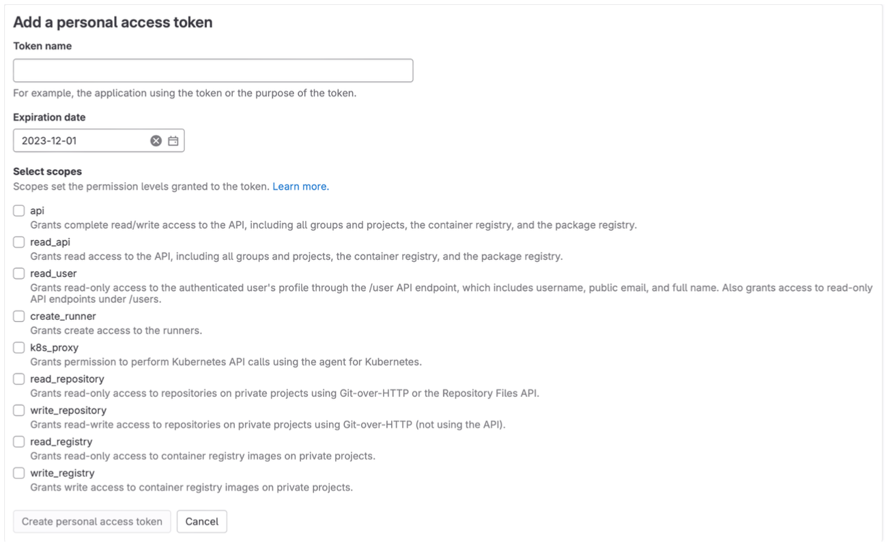
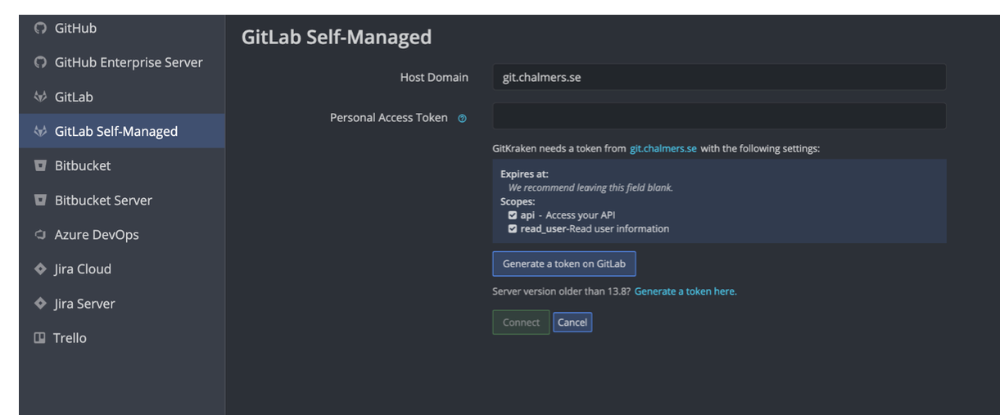
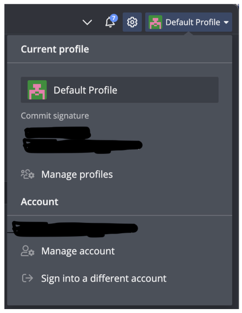
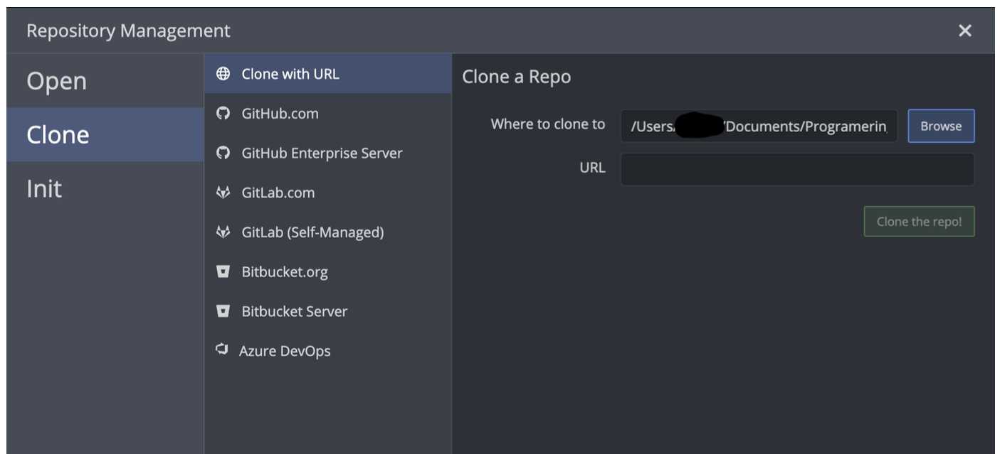

# Tutorial: using GitKraken to manage GitLab

If you"re looking to use Git with an intuitive interface, GitKraken is a great option.
The following information provides details on how to install and use it.
You can find the guide on how to use it here: <https://data101.dtek.se/beginner/git/basics.html>.

*Note*: The example code in the link above is written in Haskell, but the instructions for using the program apply to all programming languages.

Firstly, visit the following site to create a GitHub account (which is required to access the Pro version of GitKraken).
Create your account using your Chalmers credentials at <https://github.com/signup>.
After you have created your GitHub account, go to <https://www.gitkraken.com/> to download GitKraken for your device.
Choose the "Client version" for the download.
Then, secure your Pro version access by visiting <https://www.gitkraken.com/github-student-developer-pack-bundle>.

Click on "Get Free Student Pack," then "Sign up for the Student Developer Pack," and finally, "Get student benefits."
Log in with your account and follow the procedure to set up your account and gain access to the Pro version.
(Allow the site to access your location; otherwise, it may cause problems).

Once that is completed, log in to your GitLab account via this link: <http://git.chalmers.se/>.
To create an access token, follow these steps: Click on your profile and then select "Edit profile".

After that, click on "Access Tokens," followed by "Add a new token." You will see a page similar to this:

Name the token as you wish (it's recommended to name it "accessToken"), then click on the "api" checkbox, and finally click on "Create personal access token."
Now that you have everything you need, return to GitKraken, click on "Clone," and then select "GitLab Self-Managed".

You will see a screen similar to the one in the photo above.
For the "Host Domain," enter "git.chalmers.se" and then copy the access token you created into the "Access Token" field.
Then, click on "Connect."
Now it's time to set up the SSH key.
To generate an SSH key, click on "Default Profile," and then select "Manage Profiles" (see photo to the right).

If you already have an SSH key, you can connect it to GitLab.
If you"re unsure whether you have an SSH key, open Terminal (on Mac) or Git Bash (on Windows) and type the following command:

    ls -al ~/.ssh

This will list any existing keys. If you don"t have one or need a new one, go back to GitKraken, navigate to "Integrations" > "GitLab Self-Managed," and then either click on "Add key to GitLab" to use an existing key or "Generate SSH key and add to GitLab" to create a new one.

You will receive an email from GitLab confirming that an SSH key has been added. Now it's time to clone the project. Select the desired project, click on "Clone," then choose "SSH" and copy the link. We"re almost there. Return to GitKraken, click on "Clone," and you should see a screen similar to this:

Choose "Clone with URL," select the destination path, paste the copied link into the URL field, and then simply click "Clone."
