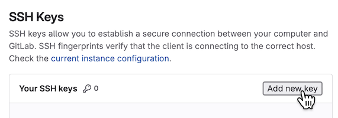
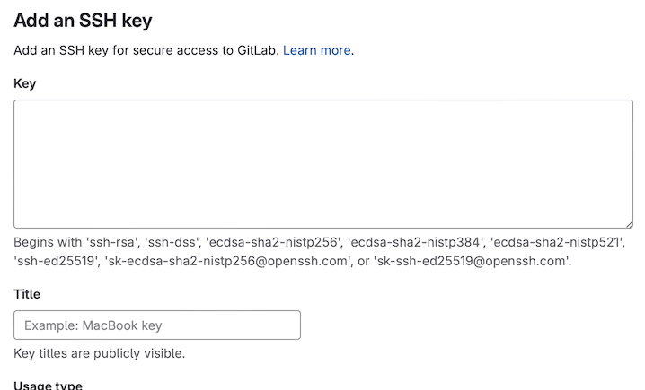

# Setting up SSH, Git and GitLab

Here are instructions on how to set up SSH, Git and GitLab.
This is something you should only have to do once – after that you will be able to work smoothly with your laborations.


## The terminal

This guide requires you do to some nasty things in the terminal. Here's how open it:
- Windows: start the program called "PowerShell"
- Mac: start the program called "Terminal"
- Linux: depends on the distribution, but if you're a Linux user you should already know it:)


## Set up an SSH key

You will use Git to synchronise your local work with the lab project on Chalmers GitLab. For this, you need an SSH key.

1. Start the terminal.

2. If you have not generated an SSH key before:
    Run `ssh-keygen` in the terminal, leaving all input prompts empty (including empty password).
    It should print the path to your public key. Look for something like:
    ```
    Your public key has been saved in C:\Users\<username>\.ssh\id_<something>.pub
    ```
    (on Mac/Linux it should be `/<...>/.ssh/id_<something>.pub` instead).

3. Go to the `.ssh` directory:
    - on Windows: `cd $home\.ssh`
    - on Mac/Linux: `cd ~/.ssh`
    - or this should work on all systems: `cd; cd .ssh`

4. Print the contents of the file by running `cat id_<something>.pub`.
    It should print something like this (the initial part may differ depending on settings):
    ```
    ssh-ed25519 ...long-string-of-numbers-and-characters... user@computer
    ```

5. Copy the whole line above and add it as a
    [key on Chalmers GitLab](https://git.chalmers.se/-/user_settings/ssh_keys):

    

6. Paste the contents of the file you copied before into the **key** textbox,
    and give your key a name:

    

    You don't need to change anything else:

7. Check your setup by running `ssh -T git@git.chalmers.se`.
    You may be prompted to confirm the authenticity of the host (just answer "yes").
    The command should then print a welcome sentence:
    ```
    Welcome to GitLab, @<username>!
    ```

Here are [more detailed/advanced instructions](https://git.chalmers.se/help/user/ssh.md). If you have any problems, ask a teaching assistant in the discussion channels or during lab supervision.


## Install Git

[Git](https://en.wikipedia.org/wiki/Git) is the industry standard for version control and collaborative software development.

First you can check if you already have it installed:
Run `git --version`, if it doesn't print an error you have it.
Otherwise there are instructions for how to [install it on your computer](https://git-scm.com/downloads/).

It will pay off to [become familiar](https://git.chalmers.se/help/tutorials/learn_git.md) with it!
The student union also has a [good introduction to Git](https://data101.dtek.se/beginner/git/intro.html).


### Problems with git-cloning?

**Note**: If you use the Chalmers lab computers, you may experience a problem with git cloning. This is due to the following:

- `ssh-keygen` puts the key in your user folder on the C drive (in `C:\...\.ssh\`).
- `git` looks for your key in your Z drive (in `Z:\.ssh\`).

To solve this, just copy over the whole `.ssh` directory from your user folder on the C drive to the Z drive.
